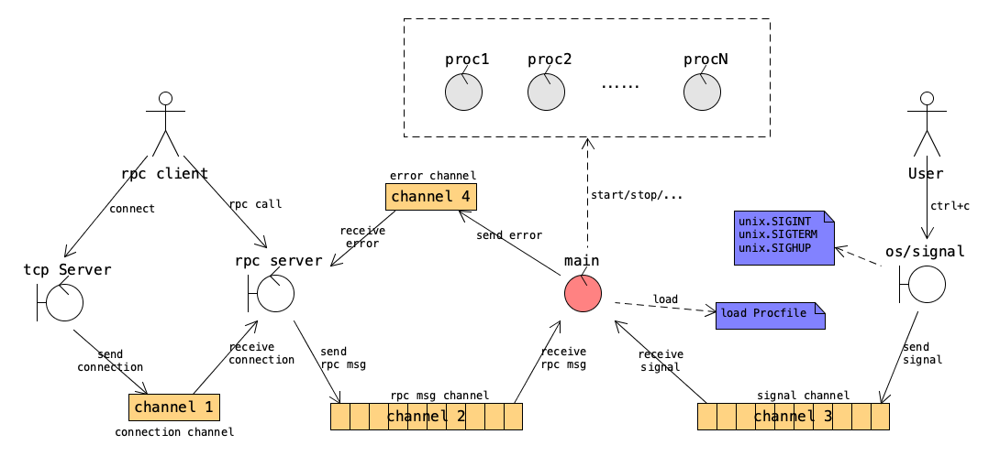

# Nutctl

Clone from https://github.com/mattn/goreman

## Getting Started

    go get github.com/hisunwei/nutshell/nutctl

## Usage

    nutctl start

Will start all commands defined in the `.nutshell/apps.Procfile` and display their outputs.
Any signals are forwarded to the processes.

## Example

See `_example` directory

## License

MIT

## Design

The main goroutine loads Procfile and starts each command in the file. Afterwards, it is driven by the following two kinds of events, and then take proper action against the managed processes.

1. It receives a signal, which could be one of SIGINT,SIGTERM and SIGHUP;
2. It receives a RPC call, which is triggered by the command "goreman run COMMAND [PROCESS...]".

